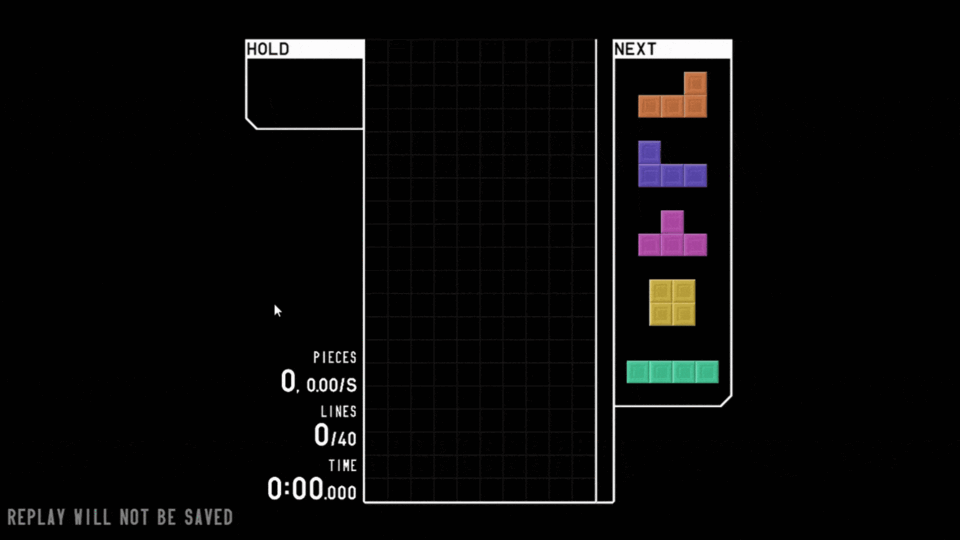

# Tetrio Agent

**Author:** Luis Alfonso Pedraos Suarez  
**Group:** "sin grupo"  
This is a bot designed to play Tetrio.

## Description

Tetrio Bot is a Python program that automates the game of Tetrio. It uses computer vision techniques to detect the pieces appearing on the game screen and makes decisions on how to place them on the board. The bot is designed to play Tetrio efficiently without human intervention.

## How to Use the Tetris Bot

1. Clone the repository.
2. Install the required dependencies using `pip install -r requirements.txt`.
3. Run the bot by executing `python main.py gui`.
4. In the GUI, click on `Load` to prepare the bot.
5. Click on `Start` to begin the automated gameplay.

## Contributions

Contributions are welcome! If you wish to improve the bot, feel free to open a pull request with your proposed changes.

---

## Descripción

El Tetrio Bot es un programa Python que automatiza el juego de Tetrio. Utiliza técnicas de visión por computadora para detectar las piezas que aparecen en la pantalla del juego y toma decisiones sobre cómo colocarlas en el tablero. El bot está diseñado para jugar Tetrio de manera eficiente y sin intervención humana.

## Cómo Usar el Tetris Bot

1. Clona el repositorio.
2. Instala las dependencias necesarias utilizando `pip install -r requirements.txt`.
3. Ejecuta el bot con `python main.py gui`.
4. En la GUI, haz clic en `Load` para preparar el bot.
5. Haz clic en `Start` para comenzar la jugada automatizada.

## Contribuciones

¡Las contribuciones son bienvenidas! Si deseas mejorar el bot, no dudes en abrir una solicitud de extracción con tus cambios propuestos.
